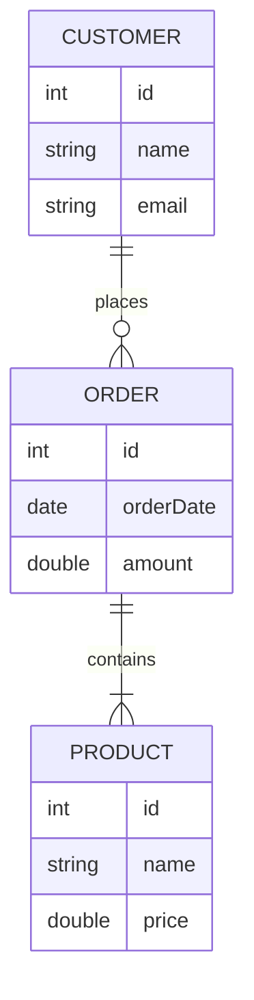

```mermaid
erDiagram
	CUSTOMER { int id string name string email }
	ORDER { int id date orderDate double amount }
	PRODUCT { int id string name double price }
	CUSTOMER ||--o{ ORDER : places ORDER ||--|{ PRODUCT : contains
```
sssss
<!--stackedit_data:
eyJoaXN0b3J5IjpbNTE4NjYwMjI0LC0xMTM2MzM2NTU2LDQ3Mj
U5ODkzMF19
-->